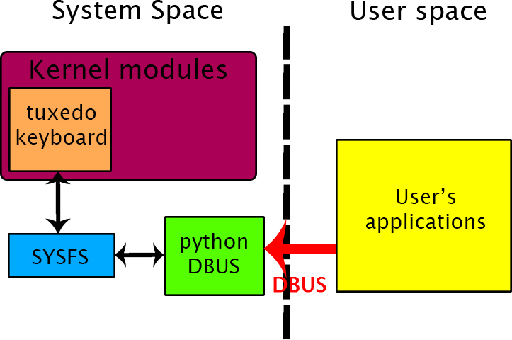

# Table of Content
- <a href="#description">Description</a>
- <a href="#install">Install</a>
- <a href="#test">Testing</a>

# Description <a name="description"></a>
Create DBUS services for Tuxedo Kerboard kernel module.
The goal is to provide all methods needed for desklets/applets.
Why? because Sysfs must not be let written by users except root. So if you want to develop some programs, dialog via DBus is the best way.


## Install <a name="building"></a>
### Summary:
Two programs with all config files needed:
- tuxedo_keyboard_dbus:
    - tuxedo_keyboard_dbus.py, program that create dbus services.
    - org.tuxedo.keyboard.conf
    - tuxedo_keyboard_dbus.service

- tuxedo_keyboard:
    - tuxedo_keyboard.py,  program to test and set all settings for keyboard backlight.
    - org.tuxedo.keyboard.policy
    - tuxedo_keyboard.desktop
    - tuxedo_keyboard.glade
    - tuxedo_keyboard.png
    - tuxedo_keyboard.glade

### Files:
#### org.tuxedo.keyboard.conf:
File needed to allow the dbus service and requests to it.
Path to install: /etc/dbus-1/system.d/org.tuxedo.keyboard.conf
```sh
sudo su
cp org.tuxedo.keyboard.conf /etc/dbus-1/system.d/
```

#### org.tuxedo.keyboard.policy:
File to authorized executing tuxedo_keyboard.py program with pkexec (gives root rights).
Change to apply: line15, update with your home directory.
Path to install: /usr/share/polkit-1/actions/org.tuxedo.keyboard.policy
```sh
sudo su
cp org.tuxedo.keyboard.policy /usr/share/polkit-1/actions/
```

#### tuxedo_keyboard_dbus.py
Program to create dbus service with tuxedo_keyboard kernel module. Launched at boot.
Path to install: /usr/sbin/tuxedo_keyboard_dbus.py
```sh
sudo su
cp tuxedo_keyboard_dbus.py /usr/sbin/
```

#### tuxedo_keyboard_dbus.service:
File to adding tuxedo_keybaord dbus service into systemd system.
Path to install: /usr/lib/systemd/system/tuxedo_keyboard_dbus.service
```sh
sudo su
cp tuxedo_keyboard_dbus.service /usr/lib/systemd/system/
```
Now you can start or stop dbus service for tuxedo_keyboard with:
```sh
sudo systemctl start tuxedo_keyboard_dbus.service
sudo systemctl stop tuxedo_keyboard_dbus.service
```
Enable at boot:
```sh
sudo systemctl enable tuxedo_keyboard_dbus.service
```

#### tuxedo_keyboard.desktop:
File to adding tuxedo_keyboard.py as application to your applications menu.
Change to apply: line 7 and 8, update with your home directory.
Path to install: /usr/share/applications/tuxedo_keyboard.desktop
```sh
sudo su
cp tuxedo_keyboard.desktop /usr/share/applications/
```

#### tuxedo_keyboard.py
Program to change settings for keyboard backlight.
Path to install: /home/YOUR_HOME/.local/share/tuxedo_keyboard/
Dependencies:
- tuxedo_keyboard.png
- tuxedo_keyboard.glade
```sh
sudo su
cp tuxedo_keyboard.py /home/YOUR_HOME/.local/share/tuxedo_keyboard/
cp tuxedo_keyboard.png /home/YOUR_HOME/.local/share/tuxedo_keyboard/
cp tuxedo_keyboard.glade /home/YOUR_HOME/.local/share/tuxedo_keyboard/
```

# Test with tuxedo_keyboard.py
Launch testing soft
```sh
sudo su
python tuxedo_keyboard.py
```
